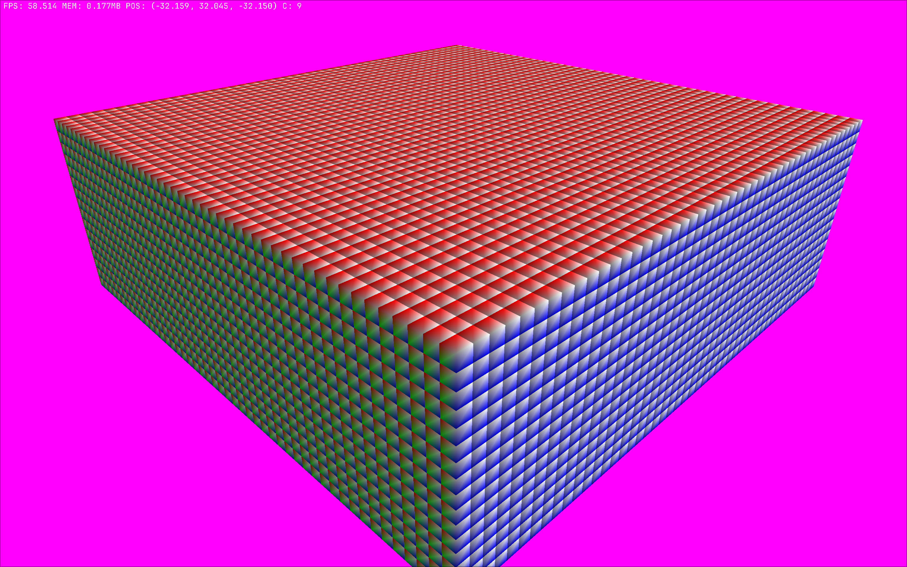

# c-voxel
This project is my attempt at writing a voxel engine in C (C23, specifically).

This is developed on Arch, so I cannot guarantee if it works on other operating systems, but I try my best

## Current Progress
So far I have written a chunk / world management system and the basic renderers. The current roadmap is as follows:
- Optimise single voxels, either by using face culling and greedy meshing or voxel packing
- Write a simple terrain generation algorithm
- Create some procedural world loading system
- Allow the player to place / remove voxels
- Make a world saving system



## Compiling
This project uses CMake to manage its build process. I have also written a helper script to compile and run the project from its parent directory, but don't expect this to work on a non-unix system.
```
-- From project root dir
./run.sh release
-- OR
cmake -S . -B build -G Ninja -D CMAKE_BUILD_TYPE=Release
cmake --build build
-- To run the executable
./build/c_voxel
```

To build this project the only external library you need to install is GLFW and some OpenGL drivers. All other libraries will be fetched by CMake.
